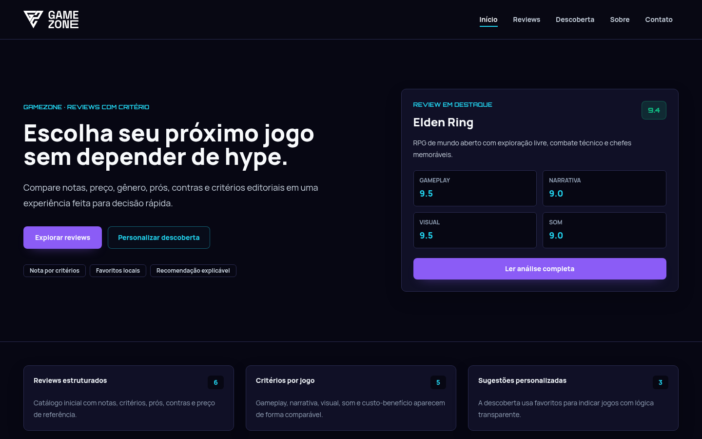
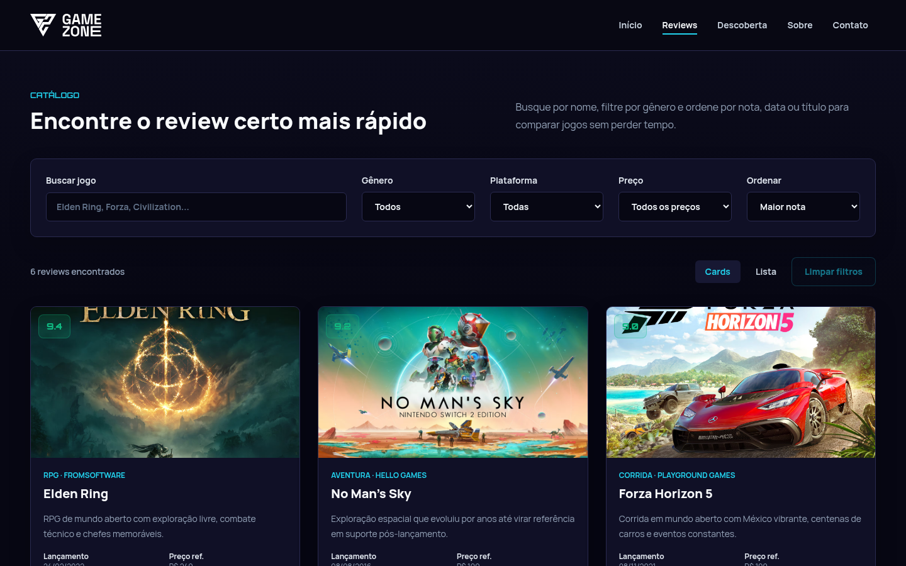
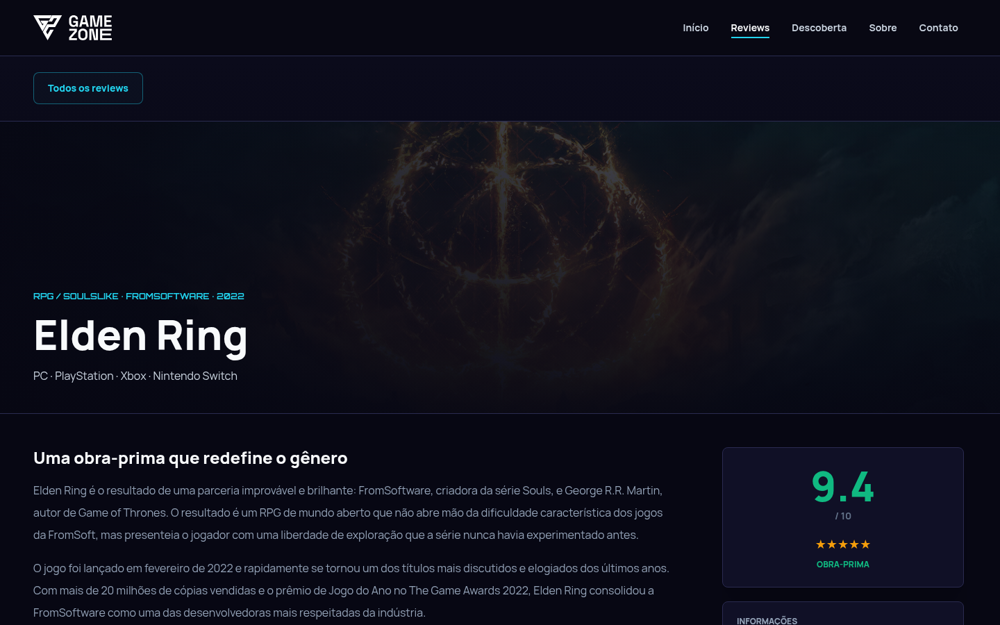
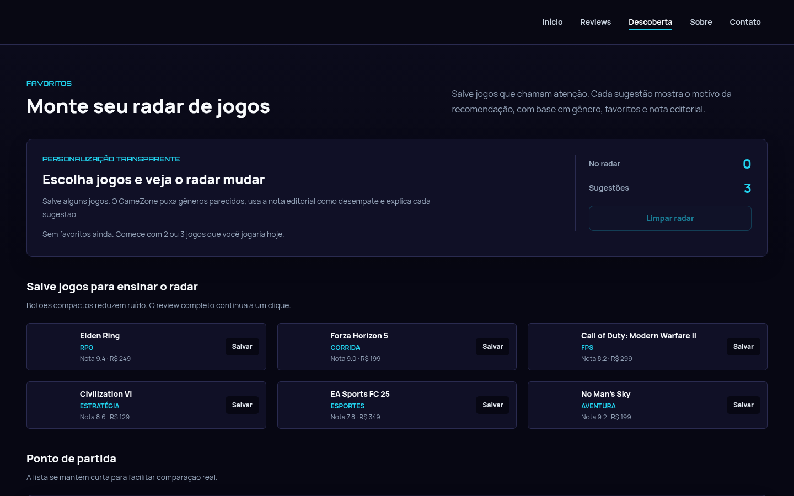

<div align="center">
  

  <h1>GameZone</h1>

  <p>Reviews próprias, critérios transparentes e recomendações que explicam o motivo de cada escolha.</p>

  <p>
    <a href="https://gamezone-source.github.io/"><strong>Acessar o projeto</strong></a>
    ·
    <a href="https://gamezone-source.github.io/api/reviews"><strong>Consultar a API</strong></a>
  </p>
</div>

## Sobre o projeto

O GameZone é o produto desenvolvido pelo grupo para o Enterprise Challenge da Palo Alto Networks. O ponto de partida foi a dificuldade de encontrar reviews honestos e espaços confiáveis para discussões saudáveis sobre jogos da nova geração.

Nesta fase, o projeto entrega o primeiro núcleo funcional dessa proposta: um catálogo editorial em que o jogador consegue pesquisar títulos, comparar critérios, consultar análises completas, salvar favoritos e receber sugestões explicáveis. As reviews são escritas pela própria equipe e também ficam disponíveis em um endpoint público.

O fórum, as contas de usuário, a moderação e o chatbot fazem parte da evolução planejada. Essa separação é intencional: o README descreve como concluído apenas aquilo que está implementado e disponível para demonstração.

## Funcionalidades

- catálogo com reviews produzidas pela equipe;
- busca por nome e filtros por gênero, plataforma e preço;
- ordenação por nota, data ou título;
- visualização em cards ou lista;
- páginas detalhadas com resumo, preço, plataformas, prós e contras;
- avaliação por critérios, pesos e nota final calculada;
- favoritos persistidos no navegador;
- recomendações baseadas em gênero e nota editorial, acompanhadas de uma justificativa;
- formulário de contato com validação de campos;
- endpoint público com os dados das reviews;
- interface responsiva e publicação automatizada no GitHub Pages.

## Capturas do produto

### Página inicial



### Catálogo e filtros



### Review detalhada



### Descoberta personalizada



## Tecnologias

| Camada | Tecnologia | Uso no projeto |
| --- | --- | --- |
| Aplicação | Next.js 16 | Rotas, renderização e geração estática |
| Interface | React 19 | Componentes e estados interativos |
| Estilos | Tailwind CSS 3 | Layout responsivo e identidade visual |
| Dados | JavaScript e JSON | Reviews, critérios e endpoint público |
| Persistência local | Web Storage API | Favoritos mantidos no navegador |
| Entrega | GitHub Actions e GitHub Pages | Build e publicação automatizados |

## Como executar

### Pré-requisitos

- [Node.js](https://nodejs.org/) 20 ou superior;
- npm, instalado com o Node.js;
- Git.

### Instalação

Clone o repositório e instale as dependências:

```bash
git clone https://github.com/GameZone-source/GameZone-source.github.io.git
cd GameZone-source.github.io
npm ci
```

Inicie o ambiente de desenvolvimento:

```bash
npm run dev
```

Acesse [http://localhost:3000](http://localhost:3000) no navegador. Alterações feitas nos arquivos da aplicação aparecem automaticamente durante o desenvolvimento.

### Build de produção

Para confirmar que o projeto pode ser publicado, execute:

```bash
npm run build
```

O `next.config.js` configura uma exportação estática. Depois do build, os arquivos prontos para hospedagem ficam no diretório `out/`.

Para servir a aplicação com `npm run start`, remova temporariamente `output: 'export'` da configuração do Next.js. No fluxo atual, a forma mais fiel de testar a entrega de produção é servir o diretório exportado:

```bash
npx serve out
```

## API pública de reviews

As reviews são produzidas pela equipe GameZone. O projeto não usa uma API externa para escrever ou enriquecer esse conteúdo. Em vez disso, disponibiliza os próprios dados para consulta pública:

```text
GET https://gamezone-source.github.io/api/reviews
```

Exemplo com `curl`:

```bash
curl https://gamezone-source.github.io/api/reviews
```

O retorno contém metadados do catálogo e a lista de reviews, incluindo título, gênero, plataformas, preço de referência, nota, critérios, prós, contras e conteúdo editorial.

## Arquitetura do projeto

```text
.
├── .github/
│   └── workflows/
│       └── pages.yml           # Build e publicação no GitHub Pages
├── app/
│   ├── contato/                # Página de contato
│   ├── descoberta/             # Favoritos e recomendações
│   ├── reviews/
│   │   └── [slug]/             # Página dinâmica de cada review
│   ├── globals.css             # Estilos globais e classes compartilhadas
│   ├── layout.jsx              # Layout raiz, navegação e rodapé
│   └── page.jsx                # Página inicial
├── components/                 # Componentes reutilizáveis da interface
├── data/
│   └── reviews.js              # Fonte de dados usada pela aplicação
├── docs/
│   ├── images/                 # Capturas utilizadas na documentação
│   └── presentation/           # Material do Enterprise Challenge
├── public/
│   ├── api/reviews             # Endpoint público exportado como arquivo estático
│   └── imagens/                # Logo e capas dos jogos
├── jsconfig.json               # Alias de importação e configuração do editor
├── next.config.js              # Exportação estática e opções de imagens
├── package.json                # Dependências e comandos npm
└── tailwind.config.js          # Tema e caminhos processados pelo Tailwind
```

### Organização das responsabilidades

O projeto usa o App Router do Next.js. Cada pasta dentro de `app/` representa uma rota, enquanto `app/layout.jsx` mantém os elementos compartilhados entre as páginas.

Os componentes visuais e interativos ficam em `components/`. Essa camada reúne desde elementos de apresentação, como cards e cabeçalhos, até fluxos que mantêm estado no navegador, como filtros, favoritos e o formulário de contato.

O arquivo `data/reviews.js` é a fonte utilizada pelas páginas do site. Ele também calcula a nota ponderada de cada review. O endpoint em `public/api/reviews` expõe uma versão estática desses dados para clientes externos.

```text
data/reviews.js
      │
      ├── página inicial e catálogo
      ├── páginas detalhadas
      └── descoberta e recomendações

public/api/reviews ──► consumidores externos
localStorage       ──► favoritos do navegador
```

## Recomendação e inteligência artificial

A recomendação atual é determinística e explicável. Ela considera os gêneros presentes nos favoritos, usa a nota editorial na ordenação e acrescenta razões legíveis para cada sugestão. Não há um modelo de inteligência artificial executando no produto atual.

A evolução documentada prevê IA em dois pontos:

- personalização capaz de reconhecer preferências mais complexas, mantendo a explicação das recomendações;
- chatbot de suporte para orientar usuários e responder dúvidas sobre a plataforma.

Antes de levar essas funções à produção, o grupo deverá definir origem dos dados, critérios de avaliação, tratamento de respostas inadequadas e limites claros para decisões automatizadas.

## Segurança

Como a versão atual é uma aplicação estática, ela não possui autenticação, banco de dados ou operações de escrita em um servidor. Os favoritos ficam no `localStorage` do próprio navegador. O formulário valida preenchimento, formato de e-mail e tamanho dos campos, mas ainda não envia dados para um backend.

Na evolução com contas e fórum, a arquitetura deverá incluir:

- autorização verificada no servidor para prevenir Broken Access Control (BAC);
- consultas parametrizadas ou uso seguro de ORM contra SQL Injection;
- armazenamento de senhas com algoritmo de hash adequado;
- validação no servidor, limitação de requisições e registro de eventos relevantes;
- moderação, denúncia e tratamento de conteúdo da comunidade;
- política de privacidade e coleta mínima de dados pessoais.

Esses itens são requisitos da próxima fase, não controles já presentes no produto.

## Publicação

O workflow [`.github/workflows/pages.yml`](.github/workflows/pages.yml) executa o build e publica a exportação estática no GitHub Pages. A aplicação está disponível em:

**https://gamezone-source.github.io/**

## Material da Atividade 4

A apresentação do pitch, com o roteiro nas notas de cada slide, está em:

[GameZone — Atividade 4 — Pitch](docs/presentation/GameZone_Atividade_4_Pitch.pptx)

Antes de enviar a atividade à FIAP, o grupo ainda deve adicionar ao primeiro slide o link do vídeo publicado como não listado no YouTube.
